# ONE-Alura-Challenge_Convertidor_moneda_y_unidades_de_masa
 
Conversor de divisas y unidades de masa utilizando el lenguaje Java. 
 Como requerimientos para hacer dicho programa solicitaron que la conversión principal sea la moneda de nuestro país a otras monedas que nos proporciono AluraLatam, 
 en mi caso es el Peso Mexicano, además de añadir un extra que consiste en agregar otro convertidor a elección libre por el desarrollador, yo elegí programar
 un convertidor de unidades de masa tomando como elemento principal el gramo (g) y poderlo convertir en otras unidades de masa métrico como es el kilogramo, 
 miligramo, tonelada, etc.

 
 ## -CARACTERISTICAS:
      
      *Conversor de moneda:
           - Converte de Pesos Mexicanos a Dólar.
           - Converte de Pesos Mexicanos a Euros.
           - Converte de Pesos Mexicanos a Libras Esterlinas.
           - Converte de Pesos Mexicanos a Yen Japonés.
           - Converte de Pesos Mexicanos a Won sul-coreano.

           - Converte de Dólar a Pesos Mexicanos.
           - Converte de Euros a Pesos Mexicanos.
           - Converte de Libras Esterlinas a Pesos Mexicanos.
           - Converte de Yen Japonés a Pesos Mexicanos.
           - Converte de Won sul-coreano a Pesos Mexicanos.
           
      *Conversor de unidades de masa:
           - Converte de Gramos a Miligramos.
           - Converte de Gramos a Centigramos.
           - Converte de Gramos a Decagramos.
           - Converte de Gramos a Hectogramos.
           - Converte de Gramos a Kilogramos.
           - Converte de Gramos a Toneladas.

## -DEMOSTRACIÓN GRAFICA DEL PROGRAMA:

 ### *Menú principal: 
 Cuenta con un menú desplegable el cual ofrece 2 opciones, convertidor de monedas y convertidor de unidades de masa, además de contar con 2 botones
 "OK" y "Cancel".
 
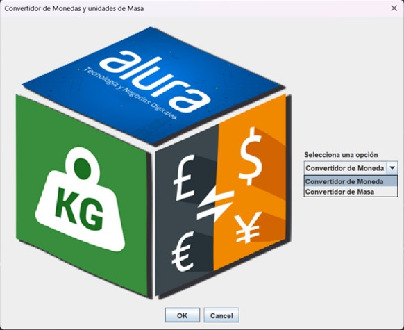

### *Convertidor de monedas: 
Es un submenú el cual tiene una lista desplegable que muestra las diferentes conversiones que puede realizar. 
 
 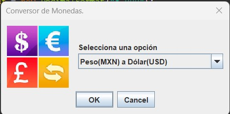
 
 
### ---Demostración de conversión:
 
 En este ejemplo se seleccionó la opción de "Peso(MXN) a Dólar(USD)".
  
  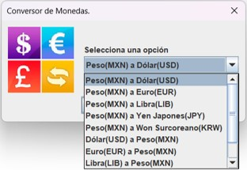 
  
 Se introdujo la cantidad a convertir ($ 50.00 pesos MXN).
  
  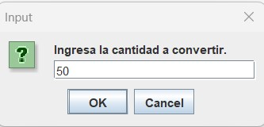
  
 Y este fue el resultado que arrojo la conversión ($ 2.75 Dólares USD).
  
   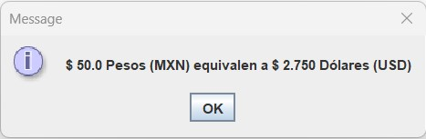
   
   
   En dado caso que se introduzca algún valor diferente de numero ya sea cualquier carácter no numérico, 
   el programa arrojaría un mensaje de error y retornar al menú de conversión.

   
   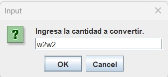 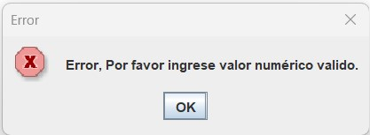
   
   ### *Convertidor de unidades de masa: 
   Es un submenú el cual tiene una lista desplegable que muestra las diferentes conversiones que puede realizar. 
 
   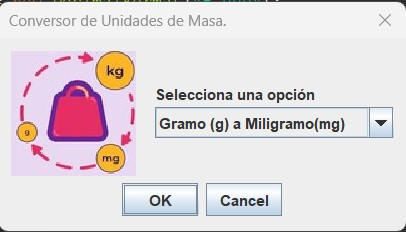
   
   ### ---Demostración de conversión:
 
   En este ejemplo se seleccionó la opción de "Gramo (g) a Miligramo(mg)".
   
   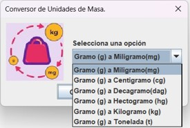
   
   Se introdujo la cantidad a convertir (100 gramos(g)).
   
   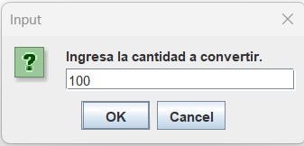
   
   Y este fue el resultado que arrojo la conversión (1000,000.00 miligramos(mg)).
   
   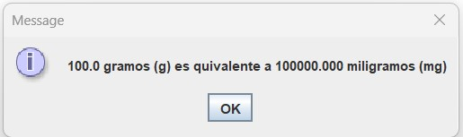
   
   En dado caso que se introduzca algún valor diferente de numero ya sea cualquier carácter no numérico, 
   el programa arrojaría un mensaje de error y retornaría al menú de conversión.

   
    
   
   ### POR ULTIMO.
   
   Si el usuario selecciona el botón de "cancel" o le da clic en la "X" del programa para cerrarlo ya sea en el menú principal o en algún submenú, 
   inmediatamente lanzara un mensaje de despedida.

   
   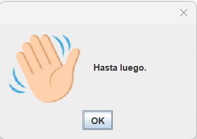
           
           
           
           
